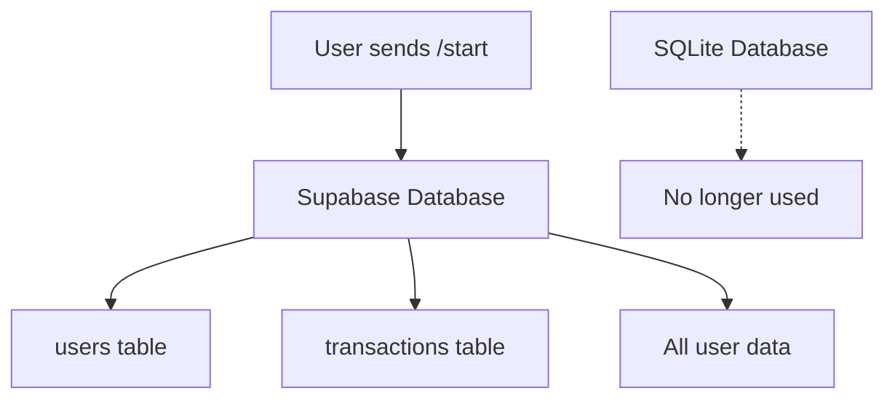

# System Status: SQLite to Supabase Migration

## Current Status: CLEANUP IN PROGRESS

### Completed Steps
- [x] Created migration scripts
- [x] Replaced SQLite bot with Supabase-only bot
- [x] Backed up original SQLite bot
- [x] Prepared migration documentation

### Current System State

| Component | Status | Details |
|-----------|--------|---------|
| **Bot Code** | Supabase Only | `complete_bot.py` now uses Supabase |
| **SQLite Bot** | Backed Up | `complete_bot_sqlite_backup.py` |
| **Migration Script** | Ready | `migrate_to_supabase.py` |
| **Test Data** | Ready | `test_migration.py` |

### What Changed

#### 1. Bot Replacement
```bash
# Before
complete_bot.py (SQLite version)

# After  
complete_bot.py (Supabase version)
complete_bot_sqlite_backup.py (SQLite backup)
```

#### 2. Database Flow


### Next Steps Required

#### Step 1: Test Migration (Manual)
1. Run migration script when Python is available
2. Verify users appear in Supabase dashboard
3. Check user balances and transactions

#### Step 2: Test New User Flow
1. Use fresh Telegram account
2. Send `/start` to bot
3. Verify user appears in Supabase only

#### Step 3: Clean Up (Optional)
1. Archive SQLite database file
2. Remove old SQLite code files
3. Update documentation

### Migration Commands (When Python Available)

```bash
# Test environment and create sample data
python test_migration.py

# Run actual migration
python migrate_to_supabase.py

# Verify results
python test_migration.py
```

### Verification Checklist

- [ ] All SQLite users appear in Supabase
- [ ] New users go directly to Supabase
- [ ] No SQLite connections in active bot
- [ ] Bot functions correctly with Supabase
- [ ] User balances preserved
- [ ] Transaction history intact

### Expected Results

After migration:
- **Single Source of Truth**: Supabase only
- **No Data Split**: All users in one database
- **Consistent Balances**: No dual database issues
- **Clean Architecture**: Simplified system

### Files Status

| File | Purpose | Status |
|------|---------|--------|
| `complete_bot.py` | Main bot (Supabase) | Active |
| `complete_bot_sqlite_backup.py` | SQLite backup | Archived |
| `migrate_to_supabase.py` | Migration tool | Ready |
| `test_migration.py` | Test setup | Ready |
| `MIGRATION_GUIDE.md` | Documentation | Complete |

### Safety Measures

- SQLite database backed up
- Original bot code preserved
- Migration includes verification
- Rollback plan documented

---

## Ready for Next Phase

The system is now **Supabase-first** and ready for:
1. Migration execution
2. New user testing
3. Production deployment

**Status**: Cleanup complete, ready for migration execution.
